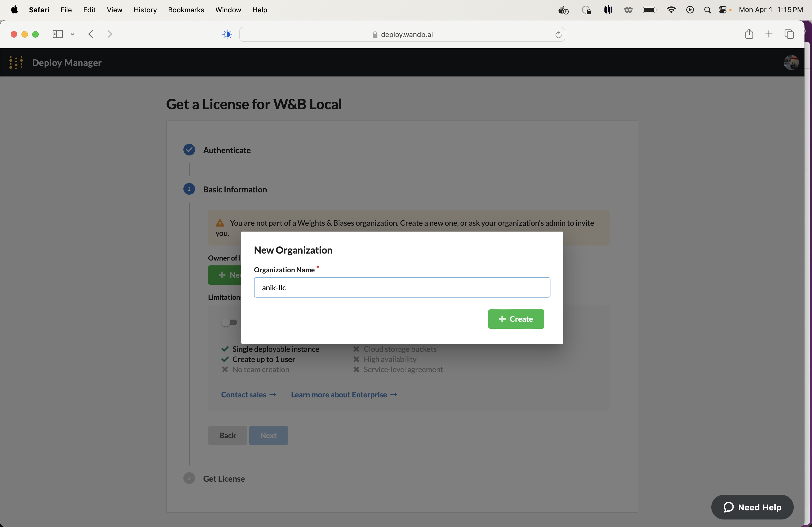
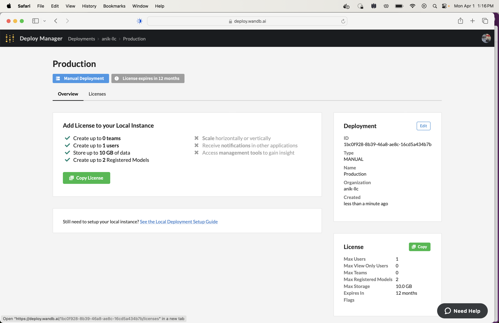
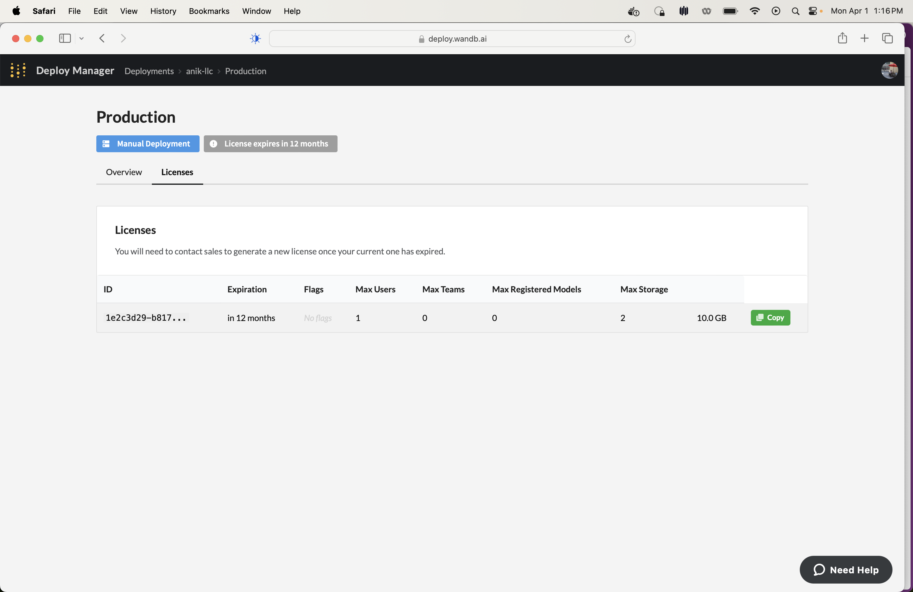

# Instructions on how to run a wandb server locally

## Prereqs

* wandb

```
(venv) $ pip install wandb
```

* Docker engine is used under the hood in the `wandb server start` command to manage various container images needed to run wandb. 
Further investigation is needed to see if wandb server start works with podman.

### Start wandb

```
wandb server start
```


### Go to http://localhost:8080 in your browswer


### Click "Login", create an account. 

Add your fullname, email, username, and a password.

Use a valid email and don't forget username and password.

### Click on "Get a free license"


### Click on "Get a free license"


### Click on "Continue"


### Click on "New Organization"


### Add an Organization Name then click "Next"



### Click "Generate License Key"


### Click "Copy License"



### Click "Copy"



### Go back to localhost:8080, click on "Add license"


### Paste license into text box

The page should go from this:


To this:


### Click "Update settings"


### Go back to localhost:8080, copy API key


### Use key in below python program called wb-run.py

```python
import wandb

WANDB_BASE_URL = "http://localhost:8080"
WANDB_API_KEY = <WANDB API KEY GOES HERE>
wandb.login(host=WANDB_BASE_URL, key=WANDB_API_KEY)
run = wandb.init(project="foo-project",group="foo-group",job_type='foo-job-type')
run.finish()
```

### Run the following python program

```sh
python wb-run.py
```

### See run under My projects


### The End. You now are ready to integrate wandb into your code and see what you've done locally!
