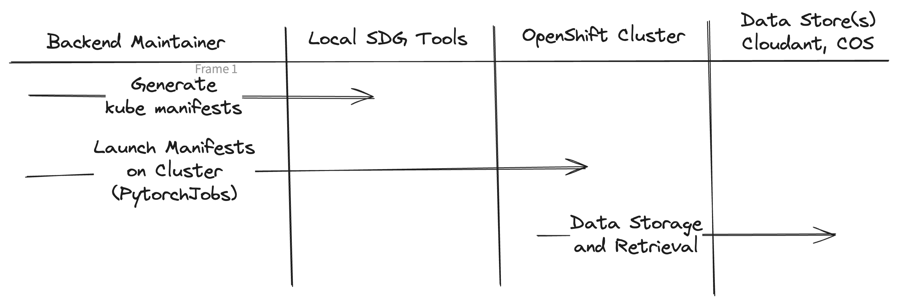
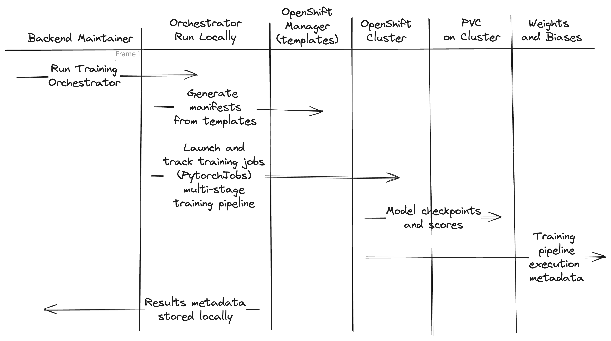
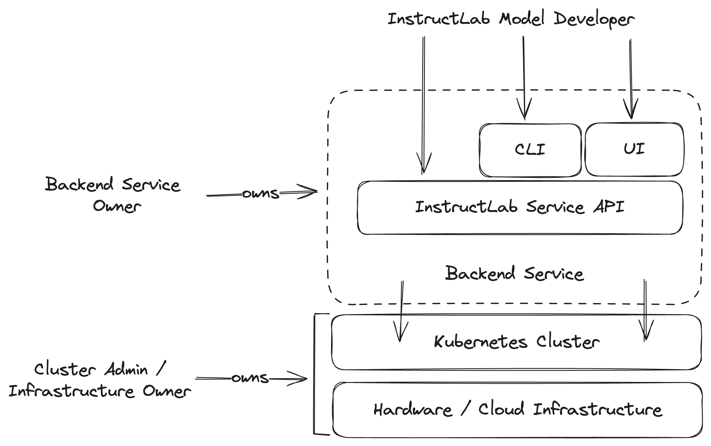
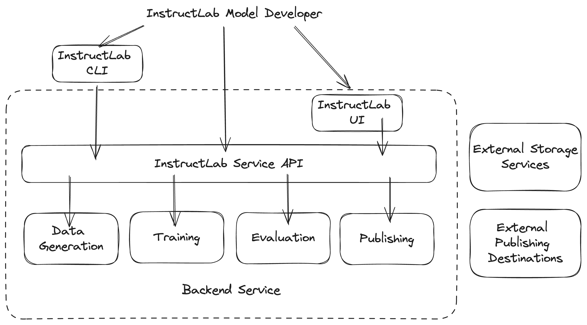
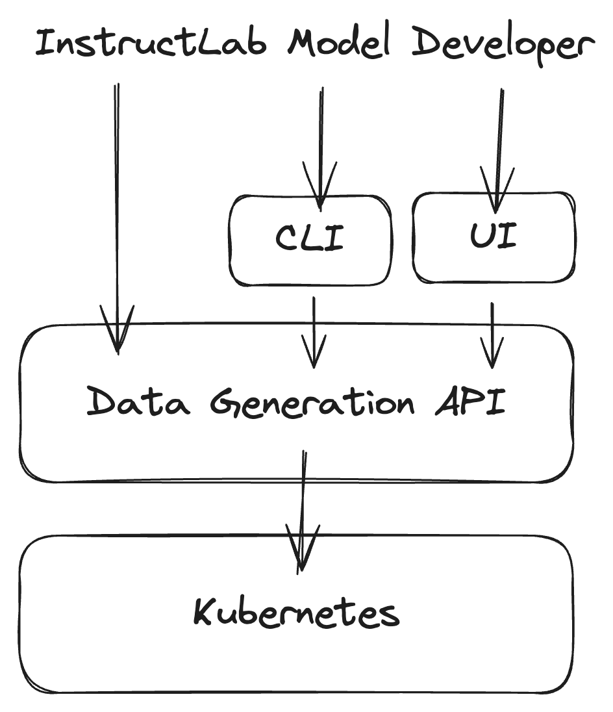

# Backend Service - Future Vision

This document outlines a future high-level vision for what the Backend Service
could look like as an evolution from where we are today.

> [!NOTE]
> This is very much a work in progress and should be considered a living document open
> to input and feedback from all interested in the direction. To ensure we have
> alignment  on common goals, we will work together to evolve this text to
> reflect our goals.

Goals:

- Specify key requirements for an evolved high-level architecture

Non Goals:

- Providing a detailed description of how the current backend is implemented.
- Getting into implementation details on a component level. We may cover key
  technology choices, but not details on how they are to be used.

## Personas

The following personas will be referenced throughout the document:

- **Cluster Administrator**: The person responsible for managing a Kubernetes cluster.
  This person cares about all hardware and its associated hardware and
  cluster-wide software resources.

- **Backend Service Owner**: The person responsible for managing the Backend Service
  on top of the cluster provided by the Cluster Administrator.

- **InstructLab Model Developer**: This person is a user of the Backend Service.
  They don't care about the underlying infrastructure details. They care about
  data sets, model training, model evaluation, and all of those types of related
  details associated with the pipeline implemented by the Backend Service.

## Current Statue

As of the launch of the project, the backend is implemented as a set of tools
that span roughly the following areas:

- SDG (Synthetic Data Generation)
- Training
- Evaluation
- Publishing

This first implementation is targeted at two specific clusters internal to IBM.
While there is not a hard dependency on them, there are assumptions throughout
about the specific software and hardware capabilities provided by these
clusters.

There are some key supporting services that the backend pipeline interacts with
at different points of the process, including:

- GitHub
- IBM COS (Cloud Object Storage)
- Hugging Face
- WandB (Weights and Biases)

At the time of writing, the most comprehensive document on how to run the full
backend is in [this document from the backend-orchestrator
repository](https://github.com/instruct-lab/backend-orchestrator/blob/main/running-backend.md).
This repository aims to create a wrapper around all of these tools to provide a
single entry point to run through the whole backend process.

In this iteration of the backend, the Backend Service Owner and Model Developer
personas are combined. While many jobs run on a cluster, all of it is driven by
running scripts on a local machine. Those scripts may interface with services
directly, they may launch and track jobs on a Kubernetes cluster, or both. We will
refer to this persona as a "Backend Maintainer" as they are typically members of
the Backend Maintainers team for InstructLab.

The rest of this section does not intend to cover any implementation details
beyond describing the dependencies between key components of the system.

### Current SDG

- <https://github.com/instruct-lab/datagen-pipeline>

### Current Training

- <https://github.com/instruct-lab/orchestrator>
- <https://github.com/instruct-lab/openshift-manager>

### Current Evaluation

- <https://github.com/instruct-lab/evaluation>

Using the evaluation repo directly consists of taking OpenShift template
manifests for PyTorchJobs and launching them on a cluster with the right fields
set for the evaluation tasks desired.

It is expected that the Orchestrator would automate this task in most cases.

In either case, the evaluation jobs run on the cluster and post results to both
WandB and object storage.

TODO - diagram

### Current Publishing

The publishing code lives in the Orchestrator repository.

- <https://github.com/instruct-lab/orchestrator>

The final step in the pipeline is publishing. This occurs after a model
checkpoint has been chosen and the corresponding evaluation results have been
stored.

Similar to other components, it starts with tools run locally. These tools
format a Kubernetes manifest to launch on the cluster which does the following:

- Get the model and evaluation results from storage (WandB / COS)
- Publish evaluation results back to PRs with changes included in this model
- Publish a ChangeLog to GitHub and HuggingFace
- Publish the model to HuggingFace

## Guiding Principles for the Future

We aim to articulate a set of guiding principles that will help guide our
technical decision-making as we evolve the Backend Service. These principles are
intended to be high-level and should be used to inform the design of the system
as a whole.

When faced with a difficult technical decision with a set of trade-offs, we should
review these principles to ensure we make a decision that aligns with them.
We should also consider these principles to be open to change as we learn more,
but they will always serve as a guide.

Summarized, these principles are:

- Vendor Agnostic
- Scalable
- Service Oriented
- Reusable
- Small Iterations

### Vendor Agnostic

The Backend Service should be able to run on any Kubernetes cluster. While we
may have specific requirements for the underlying hardware, we should not be
tied to any specific vendor.

A concrete example is that while this project was initiated by IBM and Red Hat,
we explicitly do not want to maintain a hard dependency on OpenShift. It should
work well there, but not require it.

### Scalable

The initial iteration of the Backend Service targeted a particular set of clusters
with a known set of hardware resources. As we evolve to become a more flexible
and reusable system, we must design things in a way that allows us to scale up
or down as needed.

We need to drive down the minimum requirements while also ensuring we can scale
up to much larger environments with more resources available and make full use
of those resources.

As a minimum target, we should be able to run some configuration of the full
backend pipeline on a single machine. We can use these as minimum requirements:

- Linux server with 4x H100 GPUs

### Service Oriented

The initial iteration of the Backend Service is designed as a set of scripts
that assist Backend Maintainers with launching appropriate jobs on a cluster
that perform the various backend pipeline tasks. While considering the future,
we must understand each targeted persona and design services that are focused on
their needs.

Today, the backend is not service-oriented itself, though it depends on a set
of components that are. For example:

- The cluster itself is a service owned by the Cluster Administrator and made
  available to the Backend Maintainers.

- WandB is consumed as a service.

- Backend jobs running on the cluster consume storage services (COS).

We should consider the persona of an InstructLab Model Developer and what
actions and information they care about. That should drive the service
interface provided by our Backend Service. Some examples of this point:

- An InstructLab Model Developer cares about defining inputs to our pipeline,
  launching that pipeline, following its status, and consuming its outputs.

- An InstructLab Model Developer does not care about the exact details of how
  these processes are running on a cluster. They should not require any access
  to Kubernetes APIs. The cluster itself is the concern of the Cluster
  Administrator.  Ensuring the Backend Service is configured and running
  correctly on the cluster is the concern of the Backend Service Owner.

If we map this back to the InstructLab project itself, you can imagine that the
Backend Maintainers team serves as Backend Service Owners. There may be another
team, the taxonomy maintainers, that represent InstructLab Model Developers,
focused on evaluating taxonomy contributions and running batches of them through
the backend pipeline.

### Reusable

The Backend Service was envisioned from the beginning as a pipeline of distinct
steps (data generation, training, evaluation, and publishing). This separation
of concerns should be maintained in a future service-oriented architecture. While
the diagram under [Serivce Oriented](#service-oriented) shows a high-level diagram
with a single "InstructLab Service API," in practice, this should be broken down
into multiple services with a more focused set of concerns.

Within InstructLab, we could have a top-level application that implements the
entire backend pipeline workflow and does so by making use of each of these
services. However, in the future, we could also envision these services being
used in other contexts.

### Small Iterations

While we may cast a vision for the future, we desire to get there via a series
of small iterations. We have a working backend pipeline already and will
continue to run it every week. In parallel, we can work to evolve it through a
series of small iterations that evolve it over time, gradually evolving the
execution process that occurs each week.

We do not want a new effort happening in parallel to what is already working
today.

## Key Technology Decisions

### Kubernetes

We consider Kubernetes an acceptable dependency for the Backend Service. While
it may be technically possible to run most of the code elsewhere, the project
will focus its energy on running this collection of components in a
Kubernetes-based environment.

This also applies to when these components are run on a single server. In that
environment, we expect one of the single-node Kubernetes distributions to be
used. One example is [Microshift](https://github.com/openshift/microshift/), but
there are others.

A development environment capable of running within
[kind](https://kind.sigs.k8s.io/) would also be incredibly convenient, though not
as a production target environment.

### Programming Languages

Python is the primary language used in the current backend. It is also the
de-facto choice for AI/ML developers. We will continue using Python for core
functionality, especially when it comes to interfacing with AI/ML libraries like
Pytorch.

Another significant element of the Backend Service is automating workloads on
Kubernetes. The most popular language in this context is Go. Kubernetes itself
is in Go, and the Go client libraries are the most mature.

To best support the full scope of the project, we will use both Python and Go,
depending on the specific needs of the component in question.

## An Example Service - Data Generation

The Data Generation step is the first piece of the backend pipeline. To help
illustrate this future direction in more detail, we can use it as an example to
discuss in more detail. The [current SDG](#current-sdg) section provides a
high-level overview of how SDG works today.

Moving to a services-based architecture can be done mostly a wrapper around what
exists today. While today, we have:

- Developer generates manifests
- Developer launches manifests on a cluster

Instead, we would have a Data Generation Service running in a cluster.

- Developer issues a request to the Data Generation Service via its API
  directly, a CLI that uses that API, or some other UI that uses this API.

We could implement this evolution of SDG without any impact to the rest of the
existing pipeline implementation.

