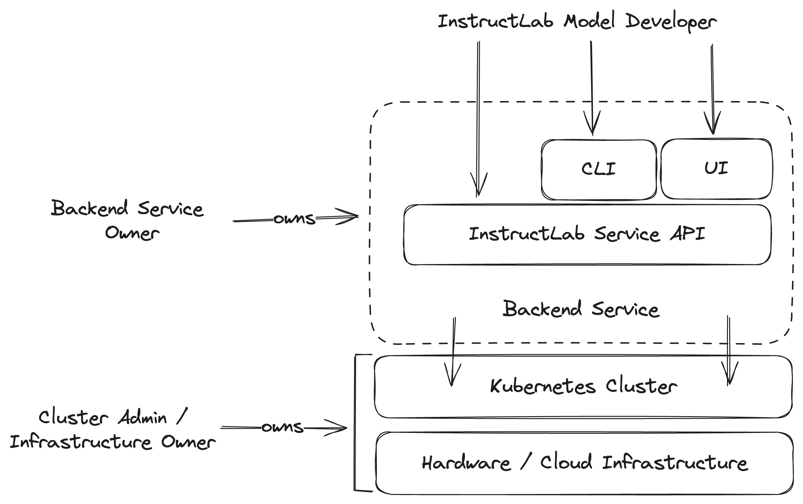
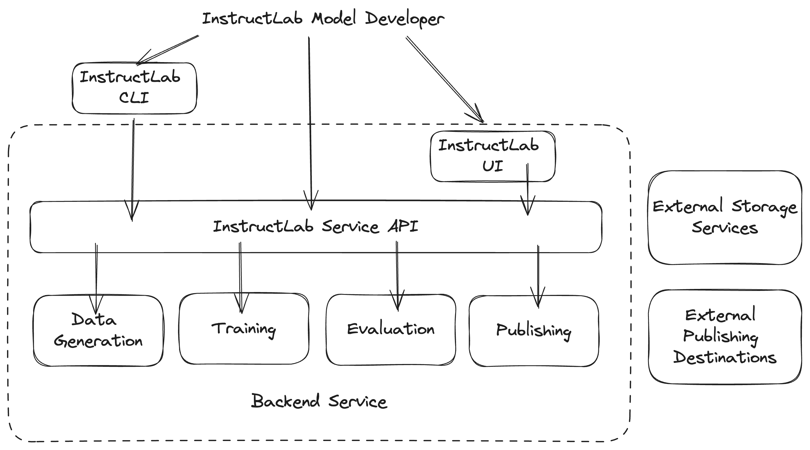

# Backend Service - Future Vision

This document outlines a future high-level vision for what the Backend Service
could look like as an evolution from where we are today.

Goals:

- Specify key requirements for an evolved high-level architecture

Non Goals:

- Providing a detailed description of how the current backend is implemented.
- Getting into implementation details on a component level. We may cover key
  technology choices, but not details on how they are to be used.

## Personas

The following personas will be referenced throughout the document:

- **Cluster Administrator**: The person responsible for managing a Kubernetes cluster.
  This person cares about all hardware and its associated hardware and
  cluster-wide software resources.

- **Backend Service Owner**: The person responsible for managing the Backend Service
  on top of the cluster provided by the Cluster Administrator.

- **InstructLab Model Developer**: This person is a user of the Backend Service.
  They don't care about the underlying infrastructure details. They care about
  data sets, model training, model evaluation, and all of those types of related
  details associated with the pipeline implemented by the Backend Service.
  - **Sub-category A**: A Model Developer who is trying to add domain-specific
  knowledge to the model and is very interested in how they have improved (or
  not) the model in that specific domain
  - **Sub-category B**: A Model Developer who is interested in improving an
  overall model benchmark

## Guiding Principles for the Future

We aim to articulate a set of guiding principles that will help guide our
technical decision-making as we evolve the Backend Service. These principles are
intended to be high-level and should be used to inform the design of the system
as a whole.

When faced with a difficult technical decision with a set of trade-offs, we should
review these principles to ensure we make a decision that aligns with them.
We should also consider these principles to be open to change as we learn more,
but they will always serve as a guide.

Summarized, these principles are:

- Scalable
- Service-Oriented
- Observable
- Reusable
- Small Iterations
- Minimize Mandatory External Dependencies
- Make Development Accessible
- Model Independence

### Scalable

The initial iteration of the Backend Service targeted a particular set of clusters
with a known set of hardware resources. As we evolve to become a more flexible
and reusable system, we must design things in a way that allows us to scale up
or down as needed.

We need to drive down the minimum requirements while also ensuring we can scale
up to much larger environments with more resources available and make full use
of those resources.

As a minimum target, we should be able to run some configuration of the full
backend pipeline on a single machine. We can use these as minimum requirements:

- Linux server with 4x H100 GPUs

### Service-Oriented

While considering the future, we must understand each targeted persona and
design services that are focused on their needs.

We should consider the persona of an InstructLab Model Developer and what
actions and information they care about. That should drive the service
interface provided by our Backend Service. Some examples of this point:

- An InstructLab Model Developer cares about defining inputs to our pipeline,
  launching that pipeline, following its status, and consuming its outputs.

- An InstructLab Model Developer does not care about the exact details of how
  these processes are running on a cluster. They should not require any access
  to Kubernetes APIs. The cluster itself is the concern of the Cluster
  Administrator.  Ensuring the Backend Service is configured and running
  correctly on the cluster is the concern of the Backend Service Owner.

If we map this back to the InstructLab project itself, you can imagine that the
Backend Maintainers team serves as Backend Service Owners. There may be another
team, the taxonomy maintainers, that represent InstructLab Model Developers,
focused on evaluating taxonomy contributions and running batches of them through
the backend pipeline.

### Observable

The Backend Service must be observable, both by the Backend Service Owners and
by InstructLab Model Developers.

### Reusable

The Backend Service was envisioned from the beginning as a pipeline of distinct
steps (data generation, training, evaluation, and publishing). This separation
of concerns should be maintained in a future service-oriented architecture.
The diagram under [Service-Oriented](#service-oriented) shows a high-level diagram
with a single "InstructLab Service API." Implementation of each sub-section of
the functionality should be done in such a way that the core of it is reusable.
In some cases that may be via libraries. In others, it may make sense to build a
microservice that can be used in other contexts.

Within InstructLab, we could have a top-level application that implements the
entire backend pipeline workflow and does so by making use of each of these
libraries and/or services.

### Small Iterations

While we may cast a vision for the future, we desire to get there via a series
of small iterations. We have a working backend pipeline already and will
continue to run it every week. In parallel, we can work to evolve it through a
series of small iterations that evolve our processes over time to use new
service-based interfaces, gradually evolving the execution process that occurs
each week.

We do not want a new effort happening in parallel to what is already working
today.

### Minimize Mandatory External Dependencies

Major external dependencies should be made optional where feasible to do so.
The more of these we require, the more complicated it will be to reuse this
system in other environments.

In other cases, it may be appropriate to provide an abstraction for the
dependency so that alternatives can be put in place. Alternate Object Storage
systems are a good example.

### Make Development Accessible

Most people will not have direct access to a large cluster to test changes
to this system. We should create development environments and minimal
configurations as much as possible to lower the barrier to doing useful
development and testing with these components.

### Model Independence

We desire to keep the backend flexible such that serving and training alternate
models in the future is not more work than absolutely necessary.

## Key Technology Decisions

### Kubernetes

We consider Kubernetes an acceptable dependency for the Backend Service. While
it may be technically possible to run most of the code elsewhere, the project
will focus its energy on running this collection of components in a
Kubernetes-based environment.

This also applies to when these components are run on a single server. In that
environment, we expect one of the single-node Kubernetes distributions to be
used. One example is [Microshift](https://github.com/openshift/microshift/), but
there are others.

Note however that the core backend pipeline components should also be able to
run directly on a single server without the backend services. These capabilities
can be executed directly using the `ilab` CLI.

A development environment capable of running within
[kind](https://kind.sigs.k8s.io/) would also be incredibly convenient, though not
as a production target environment.

### Programming Languages

Python is the primary language used in the current backend. It is also the
de facto choice for AI/ML developers. We will continue using Python for core
functionality, especially when it comes to interfacing with AI/ML libraries like
PyTorch.

Another significant element of the Backend Service is automating workloads on
Kubernetes. The most popular language in this context is Go. Kubernetes itself
is in Go, and the Go client libraries are the most mature.

To best support the full scope of the project, we will use both Python and Go,
depending on the specific needs of the component in question.

## An Example Service - Data Generation

The Data Generation step is the first piece of the backend pipeline. To help
illustrate this future direction in more detail, we can use it as an example to
discuss in more detail.

The first step taken here was to create an SDG Python library. More information
can be found in the [proposal](../sdg-repo.md) and
[repository](https://github.com/instructlab/sdg).

That library can be reused by:

- The `ilab` CLI
- The contents of a job that runs on Kubernetes and is orchestrated by a future
  InstructLab API server
- The contents of a job run by an SDG focused microservice, should someone want
  to make use of this functionality as a service outside of InstructLab
