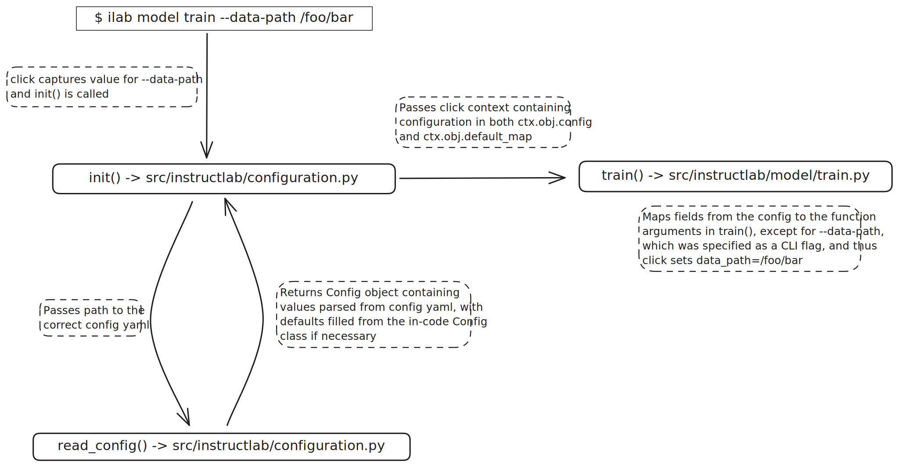

# `ilab` Configuration Design as of 0.18.0

## Config Terminology

### Config Layers

There are several locations where config can be specified. These are defined below in order of ascending precedence:

1. The `Config` class in `configuration.py` stores all the general config defaults in code
1. `config.yaml` is where the user defines their own set of defaults for the system. This can be generated using `ilab config init` and modified using `ilab config edit`. Users can also provide partial config files, for which the rest of the defaults will resort to those defined in the `Config` class.
1. The user can specify CLI flags when running an `ilab` subcommand, which will override all other configuration.

### Click-isms

[Click](https://click.palletsprojects.com/en/8.1.x/) is a Python library that provides various utilities for Command-Line Interfaces. `ilab` uses these to varying extents to store or pass around config state:

- **Groups & Commands**: Click exposes functionality for 'commands' and 'command groups'. For example, `ilab`, `data`, and `model` are all command groups, whereas `generate`, `train`, and `evaluate` are all commands. We will refer to the latter as subcommands, to clarify that they lie below `ilab` in the command hierarchy.

- **Function Decorators**: CLI commands and subcommands can define their command line arguments in function decorators. Among other things, argument defaults can be defined here. For example:

```python
@click.option(
    "--num-instructions",
    type=click.INT,
    default=-1,
    hidden=True,
)
```

- **Context**: Click provides a context (`ctx`) object that can be passed across command groups and their members. We use it mainly to pass around the configuration we generate from reading the defaults defined in code and/or the config file (as previously described). Specifically, we assign the configuration in various areas under `ctx.obj`. We elaborate on this later in the doc

- **Click Extensions** `clickext.py` defines some helpful extensions to click functionality that we use throughout the config process. Specifically, `clickext` manages the funnelling of `config` defaults into `click` options. The `clickext.ConfigOptions` class maps values stored in `ctx.obj.config` and `ctx.obj.default_map` to the click arguments defined in a subcommand decorator, for example:

```python
@click.option(
    "--data-path",
    ...
    cls=clickext.ConfigOption,
    typ
)
```

This allows the function to read the values stored in the context object to fill that variable.

### Additional Args

A subset of the `ilab model train` config variables were deemed more advanced and less likely to be tweaked, so they are exported to a separate section of the config names "additional_args". For example, on linux, the training additional args are stored in `~/.local/share/instructlab/internal/train_configuration/additional/additional_args.yaml`.

For these, click needs separate functionality to be able to map any user-provided args to the config section. We enable this by specifying `config_sections` in the respective decorators.

```python
@click.option(
    "--learning-rate",
    ...
    cls=clickext.ConfigOption,
    config_sections="additional_arguments",
    ...
```

### Global Config

By default, `ilab` looks for and saves the config in `~/Library/Application Support/instructlab/config.yaml` on mac and `~/.config/instructlab/config.yaml` on Linux. Optionally, users can write their own config.yaml and set it's path to the `ILAB_GLOBAL_CONFIG` environment variable. Upon running `ilab config init`, the file located at that path will be copied and written to the default config path expected by `ilab`.

## Config Flow for `ilab` Commands

1. When the user runs an ilab command, click captures the CLI args provided by the user and then the flow is passed to `init()` in `configuration.py`.
1. `init()` determines which config file to use and passes the flow to `read_config`, which will read the config file and return a `Config` object back to `init()`.
1. `init()` takes the `Config` object and assigns it to 2 different fields under the click context :
    1. generates a new `Lab` object and assigns it to the click context's `obj` field (`ctx.obj = Lab(config_obj, config_file, error_msg)`)
    1. parses it into a dict and assigns it to `ctx.default_map`
1. `init()` finally checks to see if any of the args provided by the user were 'additional args' for training, and creates a dict with the defaults filled in. This dict is assigned to `ctx.default_map["train"]["additional_args"]`
1. The flow of control is then passed to the subcommand that was called (e.g. generate, train, evaluate). The command group (e.g. data, model) inherits the context from `ilab` so that the subcommand can access the fields under `ctx` by accepting it as a function argument. For example:

```python
@click.pass_context
def train(ctx, ...):
    ...
    input_dir = ctx.obj.config.generate.output_dir
    ...
```

6. If a click argument's decorator specifies `cls=clickext.ConfigOption`, the respective function parameter will inherit its value from the click context. The `ConfigOption` object reads from both `ctx.obj.config` and `ctx.default_map` 
1. Finally, click applies the CLI arguments initially provided by the user and overwrites those defaults.

Below is a diagram depicting this flow for `ilab model train`:


## Points to Keep in Mind

- Subclass in the config (e.g. `train`) needs to match the function name of the command implemented via click (e.g. `train()`)
