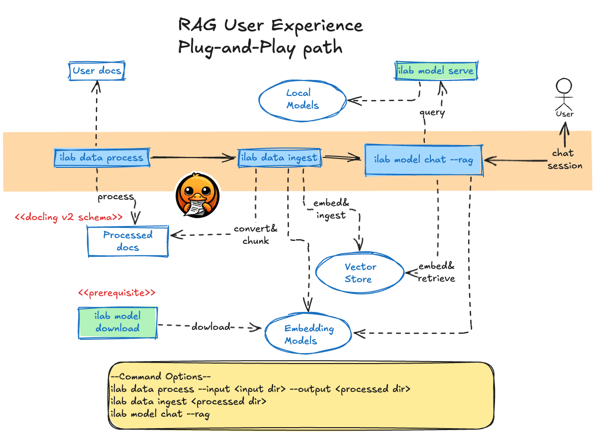
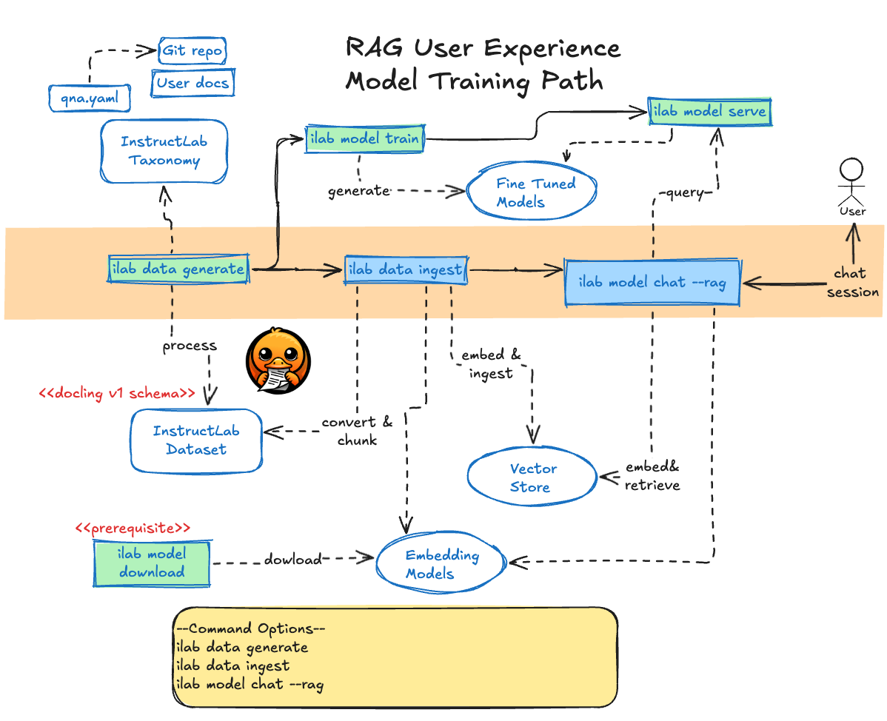
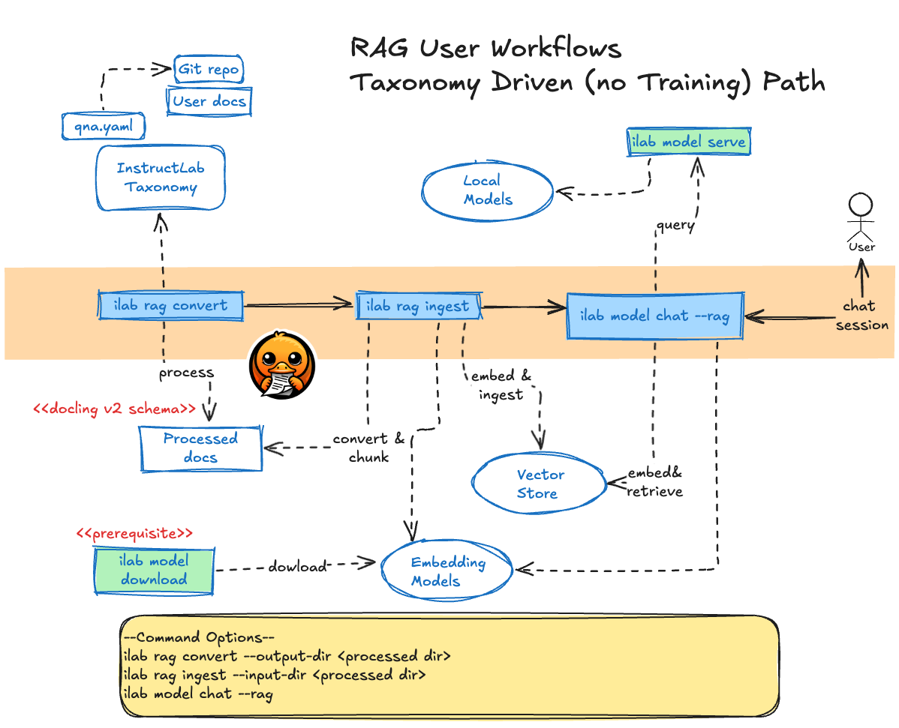
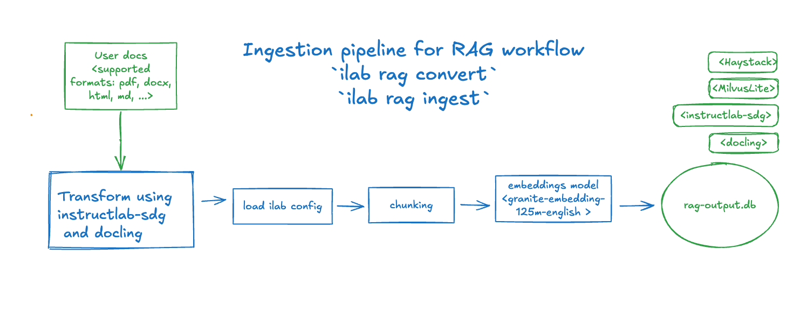
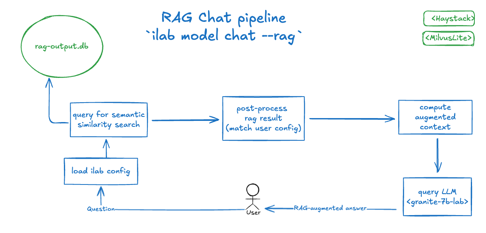

# Design Proposal - Embedding Ingestion Pipeline And RAG-Based Chat

Not addressed in this document:

* Vector store authentication options.
* Document versioning and data update policies.
* Unify prompt management in InstructLab. See (`chat_template` [configuration][chat_template] and
`augment_chat_template` [function][augment_chat_template])

**Author**: Daniele Martinoli

**Version**: 0.1

## 1. Introduction

This document proposes enhancements to the `ilab` CLI to support workflows utilizing Retrieval-Augmented Generation
(RAG) artifacts within `InstructLab`. The proposed changes introduce new commands and options for the embedding ingestion
and RAG-based chat pipelines:

* A new `ilab rag` command group, feature gated behind a `ILAB_ENABLE_EXPERIMENTAL` environment variable.
  * The application will exit with an error message if used without feature flag being set to `1`.
* A new `ilab rag` sub-command  group to process user documentation.
  * Either from knowledge taxonomy or from actual user documents.
* A new `ilab rag` sub-command to generate and ingest embeddings from pre-processed documents into a configured vector store.
* An option to enhance the chat pipeline by using the stored embeddings to augment the context of conversations, improving relevance and accuracy.

### 1.1 User Experience Overview

The commands are tailored to support diverse user experiences, all enabling the use of RAG functionality to enrich chat sessions.

### 1.2 Plug-and-Play RAG Path

This flow is designed for users who want to enhance their chat experience with pre-trained models by simply integrating the RAG functionality:


**Note**: documents are processed using `docling.DocumentConverter` and are defined using the docling v2 schema.

### 1.3 Model Training Path

This flow is designed for users who aim to train their own models and leverage the source documents that support knowledge submissions to enhance the chat context:


**Note**: documents are processed using `instructlab-sdg` package and are defined using the docling v1 schema.

### 1.4 Taxonomy Path (no Training)

This flow is for users who have defined taxonomy knowledge but prefer not to train their own models. Instead, they aim to generate RAG artifacts from source documents to enhance the chat context:


**Note**: documents are processed using `docling.DocumentConverter` and are defined using the docling v2 schema.

## 2. Proposed Pipelines

### 2.1 Working Assumption

This proposal aims to serve as a reference design to develop a Proof of Concept for RAG workflows, while
also laying the foundation for future implementations of state-of-the-art RAG artifacts tailored to specific use
cases.

#### Command Options

New configurations options are introduced to manage the execution of the new commands. Comments will be added to clarify that these configuration fields may change in the future,
as this is an experimental feature.
The command execution can be customized using the following hierarchy, where options higher in the list override those below:

* CLI flags (e.g., `--FLAG`).
* Configuration fields defined with `ilab config` commands.
* Default values, for all the applicable use cases.

#### Local embedding models

The embedding model used to generate text embeddings must be downloaded locally before executing the pipeline.

For example, this command can be used to download the `ibm-granite/granite-embedding-125m-english` model to the local models cache:

```bash
ilab model download -rp ibm-granite/granite-embedding-125m-english
```

If the configured embedding model has not been cached, the command execution will terminate with an error. This requirement applies
consistently to all new and updated commands.

### 2.2 Document Processing Pipeline

The proposal is to add a `convert` sub-command to the `rag` command group.

For the Taxonomy path (no Model Training):

```bash
ilab rag convert --output-dir /path/to/processed/folder
```

For the Plug-and-Play RAG path:

```bash
ilab rag convert --input-dir /path/to/docs/folder --output-dir /path/to/processed/folder
```

#### Processing-Command Purpose

Applies the docling transformation to the customer documents.

* Original documents are located in the `/path/to/docs/folder` input folder or in the taxonomy knowledge branch.
  * In the latter case, the input documents are the knowledge documents retrieved from the installed taxonomy repository
    according to the [SDG diff strategy][sdg-diff-strategy], e.g. `the new or changed YAMLs using git diff, including untracked files`.
* Processed artifacts are stored under `/path/to/processed/folder`.

***Notes**:

* In alignment with the current SDG implementation, the `--input-dir` folder will not be navigated recursively. Only files located at the root
  level of the specified folder will be considered. The same principle applies to all other options outlined below.
* To ensure consistency and avoid issues with document versioning or outdated artifacts, the destination folder will be cleared
  before execution. This ensures it contains only the artifacts generated from the most recent run.

The transformation is based on the latest version of the docling `DocumentConverter` (v2).
The alternative to adopt the `instructlab-sdg` modules (e.g. the initial step of the `ilab data generate` pipeline) has been
discarded because it generates documents according to the so-called legacy docling schema.

#### Processing-Usage

The generated artifacts can later be used to generate and ingest the embeddings into a vector database.

### 2.3 Document Processing Pipeline Options

**Note**: The `--help` option will be aware of the `rag` command group only if `ILAB_ENABLE_EXPERIMENTAL` environment variable is set to `1`.

```bash
% ilab rag convert --help
Usage: ilab rag convert [OPTIONS]

  The document processing pipeline for retrieval augmented generation

Options:
  --input-dir DIRECTORY  The folder with user documents to process. In case
                         it's missing, the knowledge taxonomy files will be
                         processed instead.
  --taxonomy-path PATH   Directory where taxonomy is stored and accessed from.
  --taxonomy-base TEXT   Branch of taxonomy used to calculate diff against.
  --output-dir DIRECTORY Directory where processed docs are stored.
  --help                 Show this message and exit.
```

| Option Description | Default Value | CLI Flag | Configuration Option |
|--------------------|---------------|----------|----------------------|
| Location folder of user documents. In case it's missing, the taxonomy is navigated to look for updated knowledge documents.|  | `--input-dir` | |
| Location folder of processed documents. |  | `--ouput` | |
| Directory where taxonomy is stored and accessed from. | `$HOME/.cache/instructlab/taxonomy` | `--taxonomy-path` | `rag.convert.taxonomy_path` |
| Branch of taxonomy used to calculate diff against. | `origin/main` | `--taxonomy-base` | `rag.convert.taxonomy_base` |

Equivalent YAML configuration:

```yaml
rag:
  convert:
    taxonomy_path: '...'
    taxonomy_base: 'origin/main'
```

### 2.4 Embedding Ingestion Pipeline

The proposal is to add an `ingest` sub-command to the `rag` command group.

For the Model Training path:

```bash
ilab rag ingest
```

For the Taxonomy or Plug-and-Play RAG paths:

```bash
ilab rag ingest --input-dir path/to/processed/folder
```

#### Ingestion-Working Assumption

The documents at the specified path have already been processed using the `rag convert` command or an equivalent method
(see [Getting Started with Knowledge Contributions][ilab-knowledge]).

#### Ingestion-Command Purpose

Generate the embeddings from the pre-processed documents.

* In case of Model Training path, the documents are located in the location specified by the `generate.output_dir` configuration key
  (e.g. `_HOME_/.local/share/instructlab/datasets`).
  * In particular, only the latest folder with name starting by `documents-` will be explored.
  * It must include a subfolder `docling-artifacts` with the actual json files.
* In case the */path/to/processed/folder* parameter is provided, it is used to lookup the processed documents to ingest.

**Notes**:

* To ensure consistency and avoid issues with document versioning or outdated embeddings, the ingested collection will be cleared before execution.
  This ensures it contains only the embeddings generated from the most recent run.

### Ingestion-Why We Need It

To populate embedding vector stores with pre-processed information that can be used at chat inference time.

#### Ingestion-Supported Databases

The command may support various vector database types. A default configuration will align with the selected
InstructLab technology stack.

#### Ingestion-Usage

The generated embeddings can later be retrieved from a vector database and converted to text, enriching the
context for RAG-based chat pipelines.

### 2.5 Embedding Ingestion Pipeline Options

**Note**: The `--help` option will be aware of the `rag` command group only if `ILAB_ENABLE_EXPERIMENTAL` environment variable is set to `1`.

```bash
% ilab rag ingest --help 
Usage: ilab rag ingest [OPTIONS]

  The embedding ingestion pipeline

Options:
  --document-store-type TEXT      The document store type, one of:
                                  `milvuslite`.
  --document-store-uri TEXT       The document store URI
  --document-store-collection-name TEXT
                                  The document store collection name
  --model-dir TEXT                Base directories where models are stored.
                                  [default: (The default system model location
                                  store, located in the data directory.)]
  --embedding-model TEXT          The embedding model name
  --output-dir TEXT               Directory where generated datasets are
                                  stored.
  --input-dir DIRECTORY           Directory where pre-processed documents are
                                  located.
  --help                          Show this message and exit.
```

| Option Description | Default Value | CLI Flag | Configuration Option |
|--------------------|---------------|----------|----------------------|
| Document store implementation, one of: `milvuslite`, **TBD** | `milvuslite` | `--document-store-type` | `rag.ingest.document_store.type` |
| Document store service URI. | `./embeddings.db` | `--document-store-uri` | `rag.ingest.document_store.uri` |
| Document store collection name. | `IlabEmbeddings` | `--document-store-collection-name` | `rag.ingest.document_store.collection_name` |
| Base directories where models are stored. | `$HOME/.cache/instructlab/models`  | `--retriever-embedder-model-dir` | `rag.ingest.embedder.model_dir` |
| Name of the embedding model. | **TBD**`  | `--embedding-model` | `rag.ingest.embedder.model_name` |

Equivalent YAML configuration:

```yaml
rag:
  ingest:
    document_store:
      type: milvuslite
      uri: 'embeddings.db'
      collection_name: IlabEmbeddings
    embedder:
      model_dir: '...'
      model_name: ibm-granite/granite-embedding-125m-english
```

### 2.6 RAG Chat Pipeline Command

The proposal is to add a `chat.rag.enable` configuration (or the equivalent `--rag` flag) to the `model chat` command, like:

```bash
ilab model chat --rag
```

As with the commands in the `ilab rag` group, a precondition is that `ILAB_ENABLE_EXPERIMENTAL` environment variable must be set to `1`.

#### Command Purpose

This command enhances the existing `ilab model chat` functionality by integrating contextual information retrieved from user-provided documents,
enriching the conversational experience with relevant insights.

#### Revised chat pipeline

* Start with the user's input, `user_query`.
* Use the given `user_query` to retrieve relevant contextual information from the embedding database (semantic search).
* Append the retrieved context to the original LLM request.
* Send the context augmented request to the LLM and return the response to the user.

#### Prompt Template

A default non-configurable template is used with parameters to specify the user query and the context, like:

```text
Given the following information, answer the question.
Context:
{context}
Question: 
{user_query}
Answer:
```

Future extensions should align prompt management with the existing InstructLab design.

### 2.7 RAG Chat Commands

The `/r` command may be added to the `ilab model chat` command to dynamically toggle the execution of the RAG pipeline.
This will only appear in the help list if `ILAB_ENABLE_EXPERIMENTAL` environment variable is set to `1`.

The current status could be displayed with an additional marker on the chat status bar, as in (top right corner):

```console
>>> /h                                                                                                              [RAG][S][default]
╭───────────────────────────────────────────────────────────── system ──────────────────────────────────────────────────────────────╮
│ Help / TL;DR                                                                                                                      │
│                                                                                                                                   │
│  • /q: quit                                                                                                                       │
│  • /h: show help                                                                                                                  │
│  • /a assistant: amend assistant (i.e., model)                                                                                    │
│  • /c context: change context (available contexts: default, cli_helper)                                                           │
│  • /lc: list contexts                                                                                                             │
│  • /m: toggle multiline (for the next session only)                                                                               │
│  • /M: toggle multiline                                                                                                           │
│  • /n: new session                                                                                                                │
│  • /N: new session (ignoring loaded)                                                                                              │
│  • /d <int>: display previous response based on input, if passed 1 then previous, if 2 then second last response and so on.       │
│  • /p <int>: previous response in plain text based on input, if passed 1 then previous, if 2 then second last response and so on. │
│  • /r: toggle the status of the RAG pipeline.                                                                                     │
│  • /md <int>: previous response in Markdown based on input, if passed 1 then previous, if 2 then second last response and so on.  │
│  • /s filepath: save current session to filepath                                                                                  │
│  • /l filepath: load filepath and start a new session                                                                             │
│  • /L filepath: load filepath (permanently) and start a new session                                                               │
│                                                                                                                                   │
│ Press Alt (or Meta) and Enter or Esc Enter to end multiline input.                                                                │
╰───────────────────────────────────────────────────────────────────────────────────────────────────────────────────────────────────╯
```

### 2.8 RAG Chat Options

As we stated in [2.1 Working Assumptions](#21-working-assumption), we will introduce new configuration options for the specific `chat` command.

| Description | Default Value | CLI Flag | Configuration Option |
|-------------|---------------|----------|----------------------|
| Enable or disable the RAG pipeline. | `false` | `--rag` (boolean)| `chat.rag.enabled` |
| The maximum number of documents to retrieve. | `10` | `--retriever-top-k` | `chat.rag.retriever.top_k` |
| Document store implementation, one of: `milvuslite`, **TBD** | `milvuslite` | `--document-store-type` | `chat.rag.document_store.type` |
| Document store service URI. | `./embeddings.db` | `--document-store-uri` | `chat.rag.document_store.uri` |
| Document store collection name. | `IlabEmbeddings` | `--document-store-collection-name` | `chat.rag.document_store.collection_name` |
| Base directories where models are stored. | `$HOME/.cache/instructlab/models`  | `--retriever-embedder-model-dir` | `chat.rag.retriever.embedder.model_dir` |
| Name of the embedding model. | **TBD** | `--retriever-embedder-model-name` | `chat.rag.retriever.embedder.model_name` |

Equivalent YAML document for the newly proposed options:

```yaml
chat:
    enable: false
    retriever:
      top_k: 20
      embedder:
        model_name: ibm-granite/granite-embedding-125m-english
    document_store:
      type: milvuslite
      uri: embeddings.db
      collection_name: IlabEmbeddings
```

### 2.9 References

* [Haystack-DocumentSplitter](https://github.com/deepset-ai/haystack/blob/f0c3692cf2a86c69de8738d53af925500e8a5126/haystack/components/preprocessors/document_splitter.py#L55) is temporarily adopted with default settings  until a splitter based on the [docling chunkers][chunkers] is integrated
 in Haystack.
* [MilvusEmbeddingRetriever](https://github.com/milvus-io/milvus-haystack/blob/77b27de00c2f0278e28b434f4883853a959f5466/src/milvus_haystack/milvus_embedding_retriever.py#L18)

### 2.10 Workflow Visualization

Embedding ingestion pipeline:

RAG-based Chat pipeline:


### 2.11 Proposed Implementation Stack

> **ℹ️ Note:** This stack is still under review. The proposed list represents potential candidates based on the current state of discussions.

The following technologies form the foundation of the proposed solution:

* [Haystack](https://haystack.deepset.ai/): Framework for implementing RAG pipelines and applications.
* [MilvusLite](https://milvus.io/docs/milvus_lite.md): The default vector database for efficient storage and retrieval of embeddings.
* [Docling](https://github.com/DS4SD/docling): Document processing tool. For more details, refer to William’s blog, [Docling: The missing document processing companion for generative AI](https://www.redhat.com/en/blog/docling-missing-document-processing-companion-generative-ai).

## 3. Design Considerations

* As decided in [PR #165](https://github.com/instructlab/dev-docs/pull/165), functions related to RAG ingestion
  and retrieval are located in the dedicated folder `src/instructlab/rag`.
* The solution must minimize changes to existing modules by importing the required functions from the
  `instructlab.rag` package.
* The solution must adopt a pluggable design to facilitate seamless integration of additional components:
  * **Vector stores**: Support all selected implementations (e.g., Milvus).
  * **Embedding models**: Handle embedding models using the appropriate embedder implementation for the
    chosen framework (e.g., Haystack).
  * Consider using factory functions to abstract implementations and enhance code flexibility.
* Optional dependencies for 3rd party integrations should be defined in `pyproject.toml` and documented for
  clarity. Users can install optional components with commands like:

  `pip install instructlab[milvus]`

  3rd party dependencies may also be grouped in files such as `requirements/milvus.txt`.

## 4. Future Enhancements

> ℹ️ **Note**:
>
> Following are preliminary thoughts about features we might add in the future.
> Actual design and implementation will likely change from what is defined below.

### 4.1 Model Evaluation

**TODO** A separate ADR will be defined.

### 4.2 Advanced RAG retrieval steps

* [Ranking retriever's result][ranking]:

```bash
ilab model chat --rag --ranking --ranking-top-k=5 --ranking-model=cross-encoder/ms-marco-MiniLM-L-12-v2
```

* [Query expansion][expansion]:

```bash
ilab model chat --rag --query-expansion --query-expansion-prompt="$QUERY_EXPANSION_PROMPT" --query-expansion-num-of-queries=5
```

* Using retrieval strategy:

```bash
ilab model chat --rag --retrieval-strategy query-expansion --retrieval-strategy-options="prompt=$QUERY_EXPANSION_PROMPT;num_of_queries=5"
```

* ...

### 4.3 Containerized Indexing Service

Generate a containerized RAG artifact to expose a `/query` endpoint that can serve as an alternative source :

```bash
ilab rag ingest --build-image --image-name=docker.io/user/my_rag_artifacts:1.0
```

Then serve it and use it in a chat session:

```bash
ilab serve --rag-embeddings --image-name=docker.io/user/my_rag_artifacts:1.0 --port 8123
ilab model chat --rag --retriever-type api --retriever-uri http://localhost:8123
```

[ilab-knowledge]: https://github.com/instructlab/taxonomy?tab=readme-ov-file#getting-started-with-knowledge-contributions
[sdg-diff-strategy]: https://github.com/instructlab/sdg/blob/main/src/instructlab/sdg/utils/taxonomy.py
[chat_template]: https://github.com/instructlab/instructlab/blob/0a773f05f8f57285930df101575241c649f591ce/src/instructlab/configuration.py#L244
[augment_chat_template]: https://github.com/instructlab/instructlab/blob/48e3f7f1574ae50036d6e342b8d78d8eb9546bd5/src/instructlab/model/backends/llama_cpp.py#L281
[ranking]: https://docs.haystack.deepset.ai/v1.21/reference/ranker-api
[expansion]: https://haystack.deepset.ai/blog/query-expansion
[chunkers]: https://github.com/DS4SD/docling/blob/main/docs/concepts/chunking.md