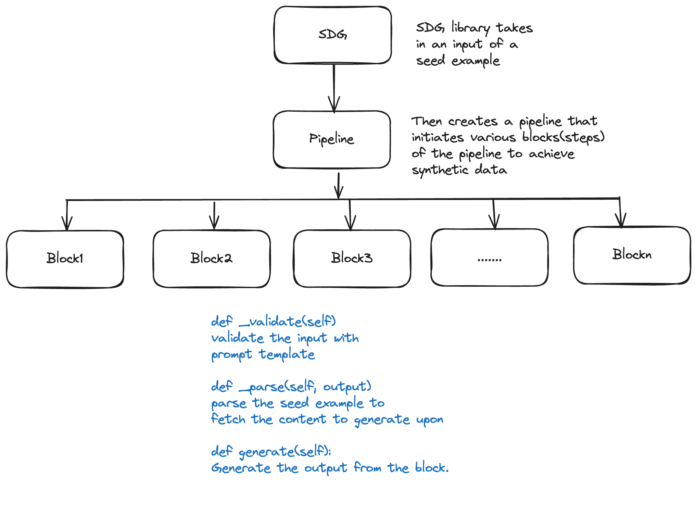

# SDG Library Design

## Objective

Library called `instructlab-sdg` that can be called per seed example that includes question and answer pairs, and context for grounded skills.

## Structure of the SDG Library

We propose the following structure for the SDG library. There will be config files that contain all the prompt templates for the pipelines.

```markdown
- src/instructlab/sdg/
    - configs/ 
        - gen_q.yaml 
        - gen_a.yaml
        - ...
    - init.py 
    - block.py 
    - llmblock.py 
    - pipeline.py 
    - sdg.py
```



## CLI

The CLI client uses the instructlab SDG library and provides it a run configuration with input parameters.

```python
# cli_driver.py

from sdg import SDG
import yaml

client = openai_client(endpoint)
with open('run_config.yaml', 'r') as file:
    run_config = yaml.safe_load(file)
cli_sdg = SDG(run_config, client)  # run config has all the variables like num_samples, pipelinesteps etc
generated_samples = cli_sdg.generate()
```

The run configuration contains the parameters needed to run the SDG code library as well as points to the templates needed to run the SDG code as well as the prompt template and the default model system prompt template.

* `num_samples` is the number of synthetic samples that you wish to generate per seed example.
* `max_retry` is the maximum number of non-greedy retries you want to make if the `num_samples` is not reached. The number of samples in the generated output will be the samples achieved until `max_retry` is reached.
* Pipeline steps contains the steps that you want to invoke in the SDG pipeline and the prompt configurations per step. The variable names of the blocks can be anything and the prompt configurations must be compatible with the teacher model.
* `max_new_tokens` is the maximum number of tokens we want to generate. In other words, the size of the output sequence, not including the tokens in the prompt.
* `model_name` is the teacher model we would want to use to generate the synthetic data.
* `model_template` and `stop_token` are the parameters for generation template.

```yaml
# run_config.yaml

num_samples : 30
max_retry : 5
pipeline_steps:
  gen_q:
    prompt_template: "configs/gen_q.yaml"
  filter_q:
   prompt_template: "configs/filter_q.yaml" 
max_new_tokens: 10000 
# model parameters for generation
model_name: mistralai/Mixtral-8x7B-Instruct-v0.1
# generation template
model_template: <s> [INST] {sys_prompt} {prompt} [/INST]
stop_token: </s>

```
