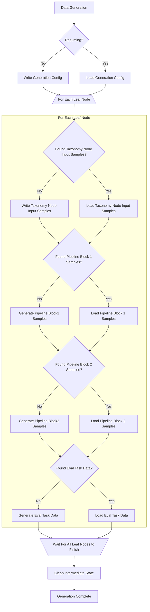

# Resuming Interrupted Synthetic Data Generation Runs

|                |            |
| -------------- | ---------- |
| Date           | 2024-09-19 |
| Scope          | Synthetic Data Generation |
| Status         | Draft |
| Authors        | [Ben Browning](@bbrowning) |

## What

Synthetic Data Generation (SDG) should track its progress and allow
users to resume interrupted runs without needing to start over from
the beginning.

## Why

SDG jobs are long-running, and may occasionally get interrupted. This
could be because it's running on a cloud spot instance, on a person's
laptop or machine that needs to shut down for the day, or perhaps a
GPU hardware failure, out of storage condition, or numerous other
reasons that could interrupt a run and cause the Python processes or
entire machine to die.

Because these are long-running jobs that can take hours (or even days,
in some cases), being able to resume from where we left off is
important from a usability standpoint. Otherwise, interrupted SDG
causes a large usability issue and wall clock time for re-work.

## Goals

The user should be able to resume from any long-running point of the
generation process from where it left off. This includes resuming
after individual blocks of a pipeline, even if the entire pipeline has
not finished yet.

The user should have a command like `ilab data generate --resume` to
explicitly indicate they want to resume an interrupted SDG run. This
is just an example, and the exact flag/CLI invocation to trigger this
should be discussed.

The following types of interruption should be handled:

* user-triggered interruptions (e.g. CTRL-c)
* SIGINT interruptions (e.g. when running on a spot instance of Pod
  which receives SIGINT)
* system hardware failure (GPU failure, power loss)

## Non-Goals

This is not replacing checkpoints. Checkpoints are how we save each
batch of generated samples after the entire pipeline has finished for
that batch. This issue is about allowing resumption at any point after
interruption, instead of only recovering entirely finished batches
which get saved as checkpoints.

## How

The primary way we'll enable this is with additional metadata tracking
and writing of intermediate state to disk instead of retaining it only
in-memory during a pipeline's execution.

Every run already has a `node_datasets_<datetime>` subdirectory where
we store the generated samples for every taxonomy leaf node. We'll
start by writing a new yaml file here containing the metadata of this
generation run. This will include anything we need to know to resume
the run, which may non-exhaustively include the taxonomy-path,
taxonomy-base, model, chunk-word-count, sdg-scale-factor, pipeline
(simple vs full vs path), batch-size, leaf nodes being generated, and
perhaps even an entire copy of the pipeline config in use. We need
enough metadata so that an `ilab data generate --resume` can resume
everything exactly as it was before, without the need to pass in each
set of original parameters. We will retain this metadata file even
after the generation run completes.

Next, we'll create a subdirectory under `node_datasets_<datetime>`
called `intermediate_state` where we'll write all of our intermediate
state files. After a successful generation run, we'll delete this
`intermediate_state` subdirectory.

A diagram of the proposed flow for a pipeline that contains two
blocks:

## Open Questions

* What's the format of the metadata config file?
* Can a user resume any interrupted run? Or only the latest?
* What do we do if the user explicitly passes in some CLI args that
  don't match what they initially used to start the generation run the
  first time? Log a warning? Error out?
* What are all the intermediate state files we need?
  * The list of all taxonomy leaf nodes in this run and their content?
  * Initial samples from each leaf node (not generated samples, but
    input samples)
  * The output from each pipeline step
* Should resume be explicit? Or implicit if we detect you have an
  unfinished generate run that used the same set of parameters?
  (Thinking about a K8s pod that gets killed and restarted by
  Kubernetes - it will get restarted with the exact same parameters vs
  knowing it explicitly needs to "resume" the second time)

## Alternatives

## Risks

## Stakeholder Impacts

| Group                         | Key Contact      | Date       | Impacted? |
| ----------------------------- | ---------------  | ---------- | --------- |
| InstructLab CLI Team          |       ?          | ?          | ?         |

## References

* [SDG Issue 267](https://github.com/instructlab/sdg/issues/267)

## Reviews
